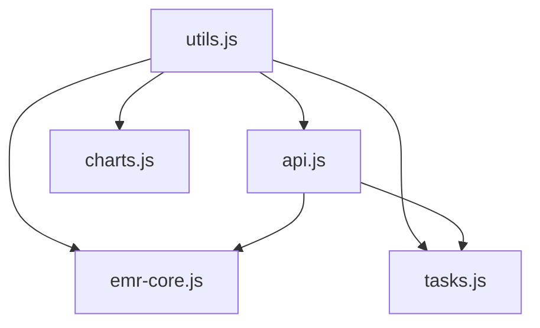

# Simple EMR System Documentation

## Overview

The Simple EMR System is a rapidly deployable and customizable Electronic Medical Record (EMR) user interface designed for laboratory-based research studies. It provides an intuitive interface for healthcare professionals to review patient cases and make informed decisions based on available medical data.

## Table of Contents

- [Getting Started](#getting-started)
- [Architecture](#architecture)
- [Frontend Documentation](#frontend-documentation)
- [Backend Documentation](#backend-documentation)
- [API Reference](#api-reference)
- [Templates](#templates)
- [JavaScript Modules](#javascript-modules)
- [Styling](#styling)
- [Deployment](#deployment)
- [Contributing](#contributing)

## Getting Started

### Prerequisites

- Python 3.8+
- Django 3.2+
- Node.js 14+ (for development)
- Modern web browser with JavaScript enabled

### Installation

1. Clone the repository:
```bash
git clone https://github.com/ajk77/SimpleEMRSystem.git
cd SimpleEMRSystem
```

2. Install Python dependencies:
```bash
pip install -r requirements.txt
```

3. Run database migrations:
```bash
python manage.py migrate
```

4. Start the development server:
```bash
python manage.py runserver
```

5. Open your browser and navigate to `http://localhost:8000`

## Architecture

The Simple EMR System follows a modular architecture with clear separation of concerns:

### Backend (Django)
- **Models**: Data structures for studies, users, and cases
- **Views**: HTTP request handlers and business logic
- **Services**: Data access layer and business operations
- **URLs**: URL routing configuration
- **Templates**: HTML templates with Django templating

### Frontend (JavaScript/HTML/CSS)
- **Core Modules**: Utility functions and API communication
- **Feature Modules**: Specific functionality (EMR core, charts, tasks)
- **Templates**: Reusable HTML components
- **Styles**: Organized CSS with responsive design

## Frontend Documentation

### JavaScript Architecture

The frontend uses a modular JavaScript architecture with the following structure:

```
static/js/
├── core/
│   ├── utils.js          # Core utility functions
│   └── api.js            # API communication layer
├── modules/
│   ├── emr-core.js       # Main EMR functionality
│   ├── charts.js         # Chart management
│   └── tasks.js          # Task management
└── legacy/               # Legacy JavaScript files
```

### Core Modules

#### Utils Module (`core/utils.js`)
Provides common utilities including:
- Cookie management
- DOM manipulation helpers
- Validation functions
- Error handling utilities

#### API Module (`core/api.js`)
Handles all backend communication:
- CSRF token management
- HTTP request/response handling
- Error handling and logging
- API endpoint abstraction

### Feature Modules

#### EMR Core (`modules/emr-core.js`)
Main application logic:
- Case management
- Item selection
- Navigation flow
- Event handling

#### Charts (`modules/charts.js`)
Chart visualization management:
- Highcharts integration
- Chart creation and updates
- Time series handling
- Interactive features

#### Tasks (`modules/tasks.js`)
Task management functionality:
- Item selection tracking
- Task completion flow
- User interaction handling

## Backend Documentation

### Services Layer

The services layer (`SEMRinterface/services.py`) provides a clean abstraction for data access:

#### Key Functions

- `get_study_ids()`: Retrieve available studies
- `get_user_details(study_id)`: Get user information for a study
- `get_case_assignments(study_id, user_id)`: Get case assignments for a user
- `load_case_details(study_id, case_id)`: Load specific case data
- `save_selected_items(...)`: Persist user selections
- `get_case_files(study_id, case_id)`: Load case-specific files

#### Error Handling

All service functions include proper error handling and logging:
- File not found errors
- JSON parsing errors
- Network communication errors
- Validation errors

### Views Layer

The views layer (`SEMRinterface/views.py`) handles HTTP requests:

#### View Functions

- `unified_selection_view()`: Study, user, and case selection
- `case_viewer()`: Main case viewing interface
- `get_case_data()`: AJAX endpoint for case data

#### Response Handling

- Consistent JSON response format
- Proper HTTP status codes
- Error message standardization
- CSRF protection

## API Reference

### Endpoints

#### GET `/`
Unified selection interface

#### GET `/case_viewer/`
Case viewer interface
- Query parameters: `study_id`, `user_id`, `case_id`

#### GET `/api/get_case_data/`
Retrieve case data
- Query parameters: `study_id`, `case_id`
- Returns: JSON with case data

#### POST `/`
Handle selection requests
- Form data: `type`, `study_id`, `user_id`
- Returns: JSON with requested data

### Response Format

All API responses follow this format:

```json
{
    "status": "success|error",
    "message": "Optional message",
    "data": { /* Response data */ }
}
```

## Templates

### Template Structure

Templates use Django's template inheritance system:

```
templates/SEMRinterface/
├── base.html                    # Base template
├── components/                  # Reusable components
│   ├── loading.html
│   └── selection_form.html
├── unified_selection.html       # Legacy selection
├── unified_selection_new.html   # New selection interface
├── case_viewer.html            # Legacy case viewer
└── case_viewer_new.html        # New case viewer
```

### Base Template

The base template (`base.html`) provides:
- Common HTML structure
- CSS and JavaScript includes
- Navigation components
- Loading overlays
- Modal dialogs

### Component Templates

Reusable components for:
- Loading indicators
- Selection forms
- Data panels
- Navigation elements

## JavaScript Modules

### Module Loading

Modules are loaded in the following order:
1. Core utilities (`utils.js`)
2. API client (`api.js`)
3. Feature modules (`emr-core.js`, `charts.js`, `tasks.js`)

### Module Dependencies



### Error Handling

All modules include comprehensive error handling:
- Try-catch blocks for async operations
- Logging with context information
- Graceful degradation
- User-friendly error messages

## Styling

### CSS Architecture

The styling system uses:
- Bootstrap 4.6.2 for base components
- Custom CSS for application-specific styles
- Responsive design principles
- Consistent color scheme
- Accessible design patterns

### Key Style Classes

- `.loading-overlay`: Full-screen loading indicator
- `.selection-form`: Form styling
- `.panel-container`: Data panel styling
- `.chart-container`: Chart wrapper
- `.highlight`: Selection highlighting

## Deployment

### Production Setup

1. Set `DEBUG = False` in settings
2. Configure static file serving
3. Set up database (PostgreSQL recommended)
4. Configure web server (Nginx + Gunicorn)
5. Set up SSL certificates
6. Configure logging

### Docker Deployment

The system includes Docker configuration:
- `Dockerfile` for containerization
- `docker-compose.yml` for orchestration
- Environment variable configuration

## Contributing

### Development Setup

1. Fork the repository
2. Create a feature branch
3. Make your changes
4. Add tests
5. Update documentation
6. Submit a pull request

### Code Standards

- Follow PEP 8 for Python code
- Use JSDoc for JavaScript documentation
- Write comprehensive tests
- Update documentation for new features
- Use meaningful commit messages

### Testing

Run tests with:
```bash
python manage.py test
```

## License

This project is licensed under the GNU General Public License v3.0. See the LICENSE file for details.

## Support

For support and questions:
- Create an issue on GitHub
- Check the documentation
- Review the code comments
- Contact the maintainers

## Changelog

### Version 2024.1
- Modular JavaScript architecture
- Improved error handling
- Enhanced documentation
- Responsive design improvements
- Performance optimizations
